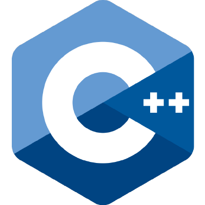

<div align="center" id="top"> 
  

  &#xa0;

  <!-- <a href="https://edb1empiricalanalysis.netlify.app">Demo</a> -->
</div>

<h1 align="center">Edb1 Empirical Analysis</h1>

<!-- <p align="center">
  

  

   -->


  <!--  -->

  <!--  -->

  <!--  -->
</p>

<!-- Status -->

<!-- <h4 align="center"> 
	🚧  Edb1 Empirical Analysis 🚀 Under construction...  🚧
</h4> 

<hr> -->

<p align="center">
  <a href="#dart-about">About</a> &#xa0; | &#xa0; 
  <a href="#sparkles-features">Features</a> &#xa0; | &#xa0;
  <a href="#rocket-technologies">Technologies</a> &#xa0; | &#xa0;
  <a href="#white_check_mark-requirements">Requirements</a> &#xa0; | &#xa0;
  <a href="#checkered_flag-starting">Starting</a> &#xa0; | &#xa0;
</p>

<br>

## :dart: About ##

A simple implementation of the following algorithms for array of integers:

* insertion sort
* selection sort
* bubble sort
* shell sort
* quick sort
* merge sort
* radix sort
### Authors
Vitor Hugo e Fernando Ferreira
### Date
Set, 2020.

## :sparkles: Documentation ##

to access the documentation through your browser access the docs folder at the root of this project then access the html folder after that select and open the index.html file

## Git Commit Guidelines

### Type

Must be one of the following:

- **feat**: A new feature
- **fix**: A bug fix
- **docs**: Documentation only changes
- **style**: Changes that do not affect the meaning of the code (white-space, formatting, missing
  semi-colons, etc)
- **refactor**: A code change that neither fixes a bug nor adds a feature
- **perf**: A code change that improves performance
- **test**: Adding missing or correcting existing tests
- **chore**: Changes to the build process or auxiliary tools and libraries such as documentation
  generation
- **wip**: Work in Progress

**Example:**

```sh
git commit -m "feat: sigaa login form implemented"
```

## :rocket: Technologies ##

The following tools were used in this project:

- [C++](https://www.learncpp.com/)
- [Cmake](https://nodejs.org/en/)
- [Doxygen](https://pt-br.reactjs.org/)
- [Make](https://reactnative.dev/)

## :white_check_mark: Requirements ##

Before starting :checkered_flag:, you need to have [Git](https://git-scm.com) and [Cmake](https://nodejs.org/en/) installed.

## :checkered_flag: Starting ##

```bash
# Clone this project
$ git clone https://projetos.imd.ufrn.br/fernandoff/sudoku.git

# Access
$ cd edb1-empirical-analysis

# Create a build folder and acess it
$ mkdir build && cd build

# to compile the project
$ cmake ../

$ make 

# Run the project
$ ./timing_template [<limit sample>] 

## Help command
$ ./timing_template --help

# Run the tests
$ ./run_tests


# Remember to compile and run the project inside the build folder
```


&#xa0;

<a href="#top">Back to top</a>
